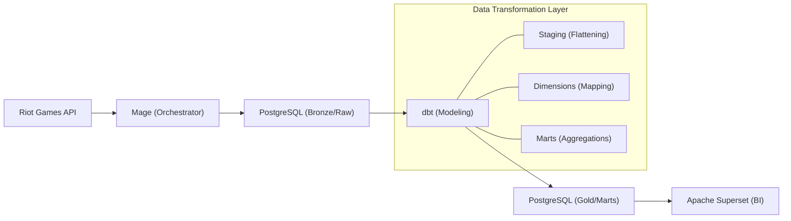
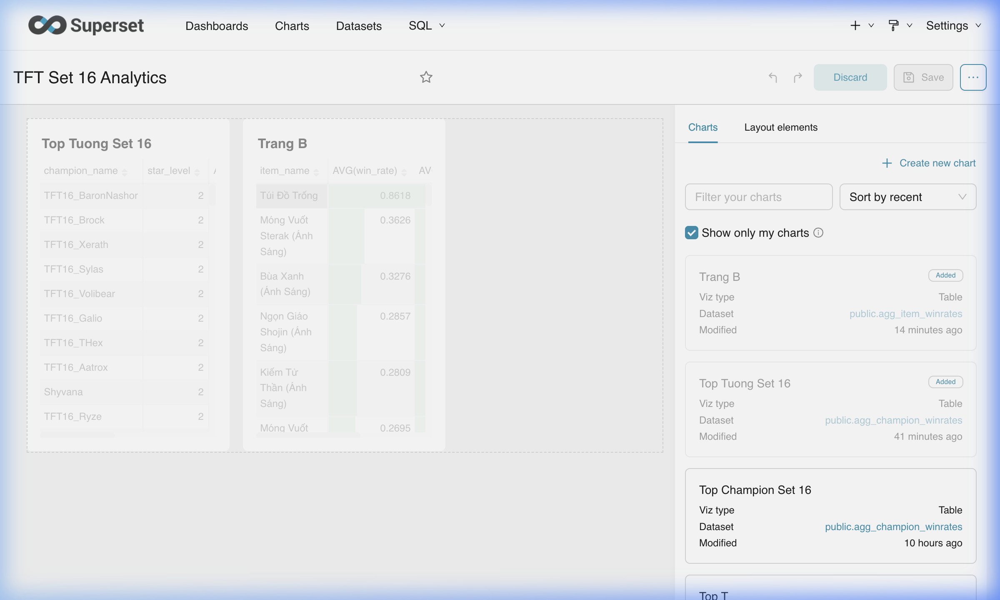

# 🐉 TFT Data Pipeline: Into the Arcane (Set 16)

[](https://mage.ai/)
[](https://www.postgresql.org/)
[](https://www.getdbt.com/)
[](https://superset.apache.org/)

Hệ thống ELT (Extract-Load-Transform) tự động hóa việc thu thập và phân tích dữ liệu hiệu năng tướng/trang bị trong **TFT Set 16: Into the Arcane** từ Riot Games API.

## 🏗 Kiến trúc hệ thống (Architecture)

Dự án tuân thủ kiến trúc **Modern Data Stack** với các tầng xử lý dữ liệu chuẩn mực:



## 🚀 Tính năng nổi bật

- **🔍 Data Purity (Set 16 Focus):** Hệ thống tự động lọc bỏ các dữ liệu "nhiễu" từ chế độ *Set 4 Revival*, đảm bảo dashboard chỉ hiển thị meta mới nhất của *Into the Arcane*.
- **⚡ Incremental Loading:** Cơ chế nạp dữ liệu delta thông minh, chỉ tải về các trận đấu mới để tối ưu hóa giới hạn API Rate Limit của Riot.
- **🇻🇳 Vietnamese Localization:** Toàn bộ tên tướng, trang bị (bao gồm đồ Ánh Sáng, Cổ Vật) và hệ tộc được mapping sang tiếng Việt 100% qua tầng dbt Seed.
- **📈 Scalable Ingestion:** Khả năng theo dõi và lấy dữ liệu từ 11,500+ người chơi rank Đại Cao Thủ/Thách Đấu.

## 📊 Dashboard Insights


- **Báo cáo Tướng:** Tỉ lệ thắng theo cấp sao, hạng trung bình.
- **Báo cáo Trang bị:** Hiệu quả của các món đồ Cổ vật và trang bị Ánh sáng.
- **Báo cáo Đội hình:** Các cặp bài trùng (Synergies) đang thống trị meta.

> [!NOTE]
> **Giải thích về chỉ số "God-tier" (80-90% Win Rate):**
> Các đơn vị như **Baron Nashor**, **T-Hex** hoặc các tướng 5 vàng (Xerath, Garen) thường có tỉ lệ vào Top 4 rất cao trong dữ liệu. Điều này là do **Survivorship Bias** (Thiên kiến người sống sót):
> 1. Đây là những đơn vị triệu hồi từ hệ tộc rất mạnh (10 Eldritch) hoặc tướng đắt tiền chỉ xuất hiện ở giai đoạn cuối trận.
> 2. Chỉ những người chơi đã thủ máu tốt và sống sót đến cuối trận mới có thể sở hữu chúng.
> 3. Do đó, sự hiện diện của chúng trên bàn cờ tương quan cực mạnh với việc thắng trận.

## 🛠 Hướng dẫn cài đặt (Installation)

1. **Clone repository:**
   ```bash
   git clone https://github.com/huukhanhdev/TFT-Data-Pipeline.git
   cd TFT-Data-Pipeline
   ```

2. **Cấu hình môi trường:**
   Tạo file `.env` tại thư mục gốc với nội dung:
   ```env
   RIOT_API_KEY=RGAPI-YOUR-KEY-HERE
   RIOT_REGION=vn2
   RIOT_ROUTING=sea
   POSTGRES_USER=postgres
   POSTGRES_PASSWORD=postgres
   POSTGRES_DB=tft_data
   ```

3. **Khởi chạy hệ thống:**
   ```bash
   docker compose up -d
   ./setup_superset.sh
   ```

4. **Chạy Pipeline:**
   - Truy cập Mage AI tại `localhost:6789` và Trigger các pipeline: `fetch_top_players` -> `fetch_match_ids` -> `fetch_match_details`.
   - Chạy dbt để biến đổi dữ liệu:
     ```bash
     docker exec -it tft_api_project-magic-1 dbt build --project-dir /home/src/dbt_project
     ```

## 📝 Liên hệ
Dự án được thực hiện bởi **[Hữu Khánh](https://github.com/huukhanhdev)**.
